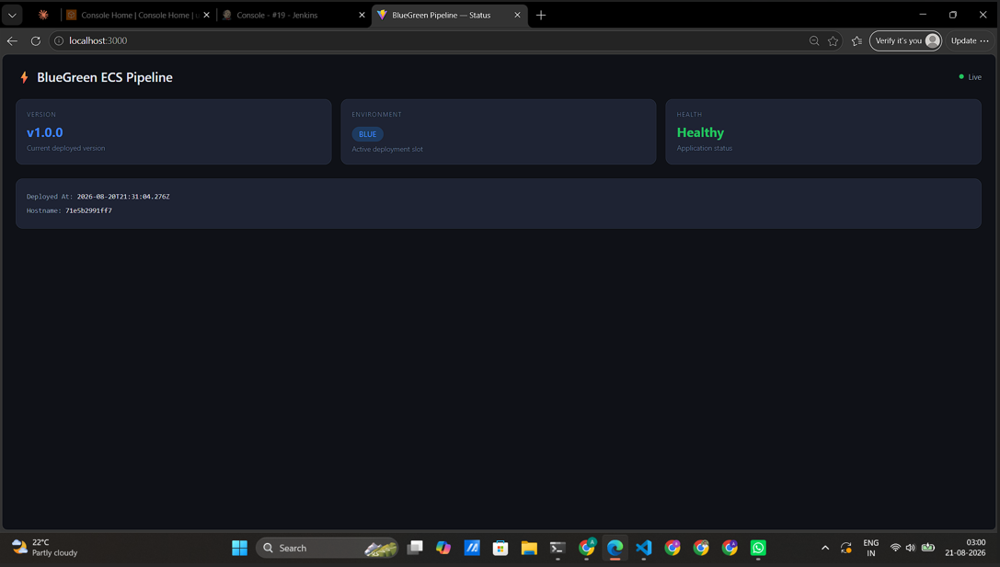
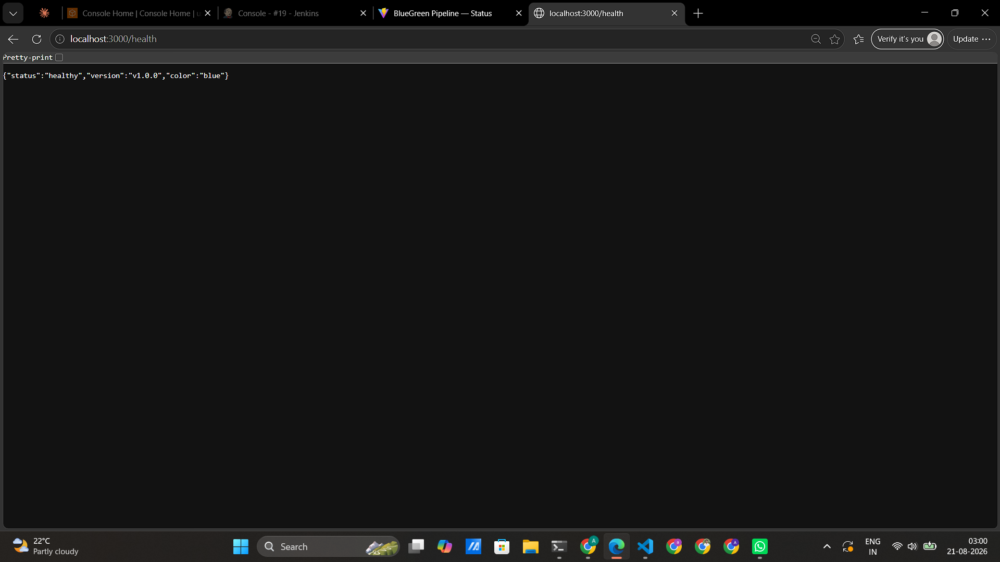
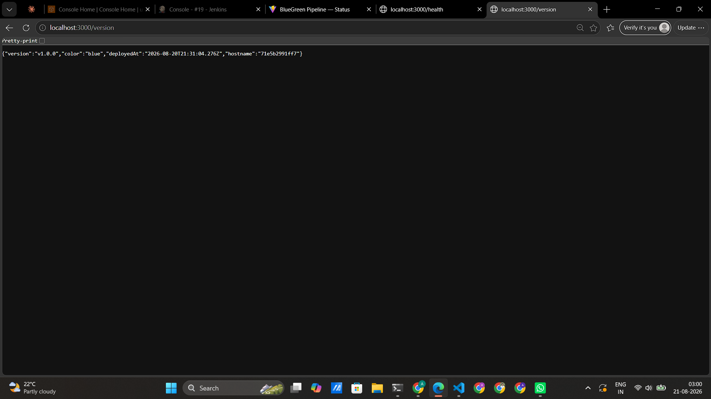
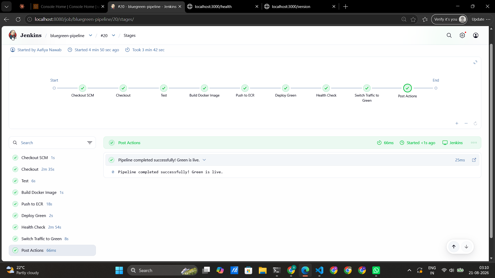
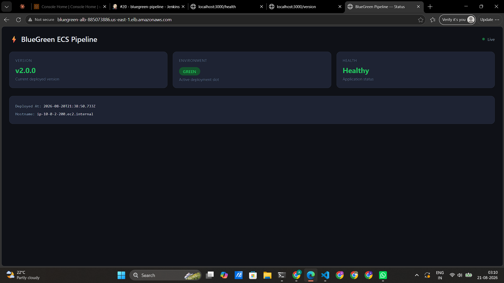
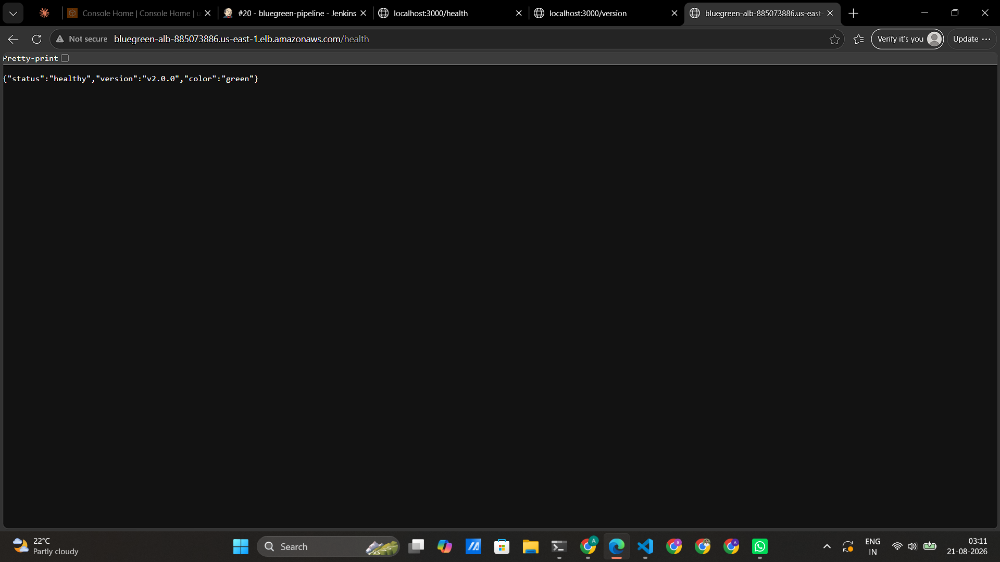
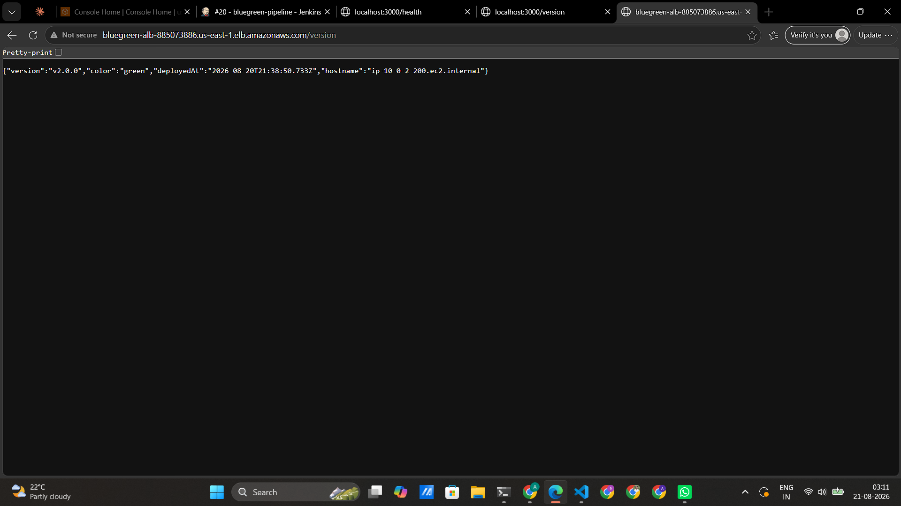
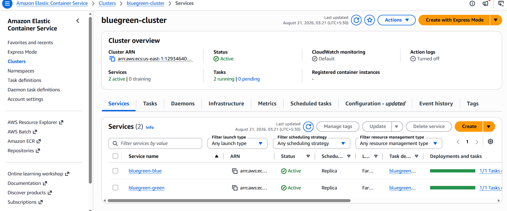
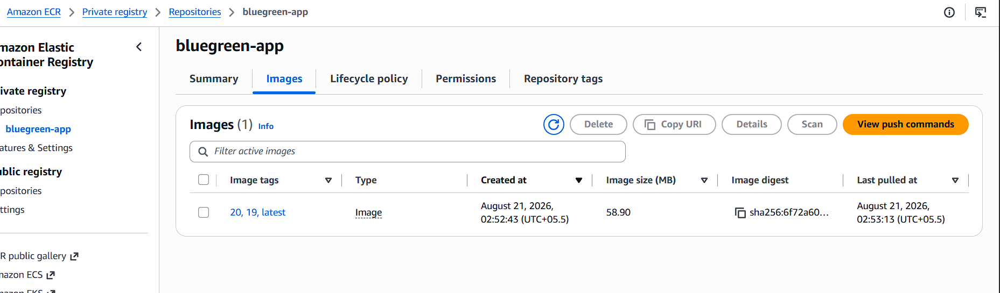
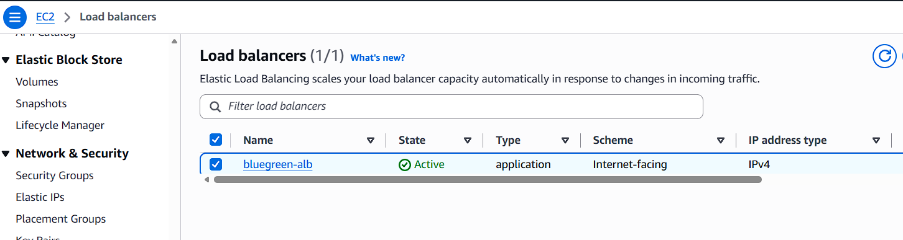

# 🔵 Blue-Green Deployment Pipeline on AWS ECS Fargate 🟢


A production-style CI/CD project demonstrating **Blue-Green deployment of a containerized Node.js application on Amazon ECS Fargate**.

The pipeline automates application testing, Docker image creation, Amazon ECR publishing, Green environment deployment, health validation, and Application Load Balancer traffic switching.

---

## 📌 Project Overview

The goal of this project is to demonstrate how a modern DevOps pipeline can deploy a new application version without immediately replacing the currently running version.

The project uses:

* **Jenkins** for CI/CD automation
* **Docker** for containerization
* **Amazon ECR** for container image storage
* **Amazon ECS Fargate** for running containers
* **Application Load Balancer** for traffic routing
* **Terraform** for Infrastructure as Code
* **Jest + Supertest** for   application testing

The project uses separate **Blue and Green ECS services** with separate target groups. Jenkins deploys the new version to Green, waits for the Green service to stabilize, and then updates the ALB listener to route production traffic to Green.

---

## 🏗️ Architecture

```text
                    Developer
                        │
                        │ Git Push
                        ▼
                GitHub Repository
                        │
                        ▼
                  Jenkins Pipeline
                        │
          ┌─────────────┴─────────────┐
          │                           │
          ▼                           ▼
     Run Jest Tests             Build Docker Image
          │                           │
          └─────────────┬─────────────┘
                        ▼
                   Amazon ECR
                        │
                        ▼
                Amazon ECS Fargate
                  ┌─────────────┐
                  │             │
                  ▼             ▼
              Blue Service   Green Service
              Current        New Version
                  │             │
                  ▼             ▼
              Blue Target    Green Target
                  │             │
                  └──────┬──────┘
                         ▼
              Application Load Balancer
                         │
                         ▼
                       Users
```

### Deployment Flow

```text
Git Push
   ↓
Jenkins
   ↓
Checkout
   ↓
Jest Tests
   ↓
Docker Build
   ↓
Push Image to ECR
   ↓
Deploy Green
   ↓
Wait for Green to Stabilize
   ↓
Health Validation
   ↓
ALB Traffic Switch
   ↓
Green Becomes Live
```

---

## 🔄 CI/CD Pipeline

### Continuous Integration

The CI portion validates the application before deployment:

```text
Checkout Source
      ↓
Install Dependencies
      ↓
Run Jest Tests
      ↓
Build Docker Image
```

If the tests fail, Jenkins stops the pipeline and the deployment stages are not executed.

### Continuous Deployment

After CI succeeds:

```text
Push Docker Image to ECR
          ↓
Deploy Green ECS Service
          ↓
Wait for ECS Service Stability
          ↓
Switch ALB Traffic
```
---
## 🧪 Automated Testing

Jest + Supertest integration tests run before deployment, validating the application, health endpoint, version, deployment color, and invalid routes.
**8 tests act as a CI quality gate — if tests fail, the pipeline stops before deployment.**

The tests act as a **CI quality gate**.

```text
Tests Pass
    ↓
Continue Pipeline
```

```text
Test Failure
    ↓
Pipeline Stops
    ↓
No Deployment
```

---

## 🌐 Application Endpoints

The Node.js + Express application exposes simple endpoints designed to demonstrate deployment behavior.

### `/`

Displays the application interface.

### `/health`

Used to determine whether the application is healthy.

Example:

```json
{
  "status": "healthy"
}
```

### `/version`

Displays deployment information such as the application version and deployment color.

Example:

```json
{
  "version": "v1.0.0",
  "color": "blue",
  "deployedAt": "..."
}
```

The `/version` endpoint makes it easy to identify which deployment environment is responding.

---

## 🛠️ Technology Stack

| Technology                    | Purpose                           |
| ----------------------------- | --------------------------------- |
| **Jenkins**                   | CI/CD automation                  |
| **GitHub**                    | Source control                    |
| **Docker**                    | Application containerization      |
| **Amazon ECR**                | Docker image registry             |
| **Amazon ECS Fargate**        | Container compute                 |
| **Application Load Balancer** | Traffic routing and health checks |
| **Terraform**                 | Infrastructure as Code            |
| **Node.js + Express**         | Web application                   |
| **Jest + Supertest**          | Automated integration tests       |
| **AWS VPC**                   | Networking                        |
| **AWS IAM**                   | Access control                    |
| **CloudWatch Logs**           | Container logging                 |

---

## 📁 Project Structure

```text
bluegreen-ecs-pipeline/
│
├── app/
│   ├── app.js
│   ├── Dockerfile
│   ├── package.json
│   └── tests/
│       └── app.test.js
│
├── jenkins/
│   └── docker-compose.yml
│
├── local-simulation/
│   ├── docker-compose.yml
│   └── nginx/
│       └── nginx.conf
│
├── terraform/
│   ├── main.tf
│   ├── variables.tf
│   ├── vpc.tf
│   ├── alb.tf
│   ├── ecs.tf
│   └── outputs.tf
│
├── docs/
│   └── screenshots/
│       ├── blue-app.png
│       ├── blue-health.png
│       ├── blue-version.png
│       ├── jenkins-pipeline.png
│       ├── green-app.png
│       ├── green-health.png
│       ├── green-version.png
│       ├── ecs-cluster.png
│       ├── ecr-repo.png
│       └── alb.png
│
├── Jenkinsfile
├── .dockerignore
├── .gitignore
└── README.md
```
---

# 📸 Screenshots

## 🔵 Blue Version — Before Deployment

### Application



### Health Check



### Version



---

## 🔧 Jenkins Pipeline

### Successful Pipeline



---

## 🟢 Green Version — After Traffic Switch

### Application



### Health Check



### Version



---

## ☁️ AWS Infrastructure

### ECS Cluster



### ECR Repository



### Application Load Balancer



---

## 💻 Run Locally

### Prerequisites

* Docker Desktop
* Node.js
* npm
* AWS CLI
* Terraform
* AWS account

### Run the Application

```bash
cd app
npm install
npm start
```

Open:

```text
http://localhost:3000
```

### Run Tests

```bash
cd app
npm install
npm test
```

### Build Docker Image

```bash
cd app
docker build -t bluegreen-app:v1 .
```

---

## 🚀 Deploy Infrastructure

Initialize Terraform:

```bash
cd terraform
terraform init
```

Review the infrastructure:

```bash
terraform plan
```

Create the infrastructure:

```bash
terraform apply
```

After testing, destroy the infrastructure to avoid unnecessary AWS charges:

```bash
terraform destroy
```

---

## 🔐 Security Practices

The project follows several basic container and cloud security practices:

* Secrets are stored through Jenkins credentials rather than committed to Git.
* AWS access is provided through IAM credentials.
* `.gitignore` prevents sensitive/local files from being committed.
* Infrastructure is managed through Terraform rather than manual configuration.

---

## 💰 Cost Awareness

AWS resources used by this project can incur charges depending on configuration and usage.
Always run:

```bash
terraform destroy
```

after completing testing when the infrastructure is no longer required.

---

## 👩‍💻 Author

**Aafiya Nawab**

[GitHub](https://github.com/Aafiyanawab) · [LinkedIn](https://linkedin.com/in/aafiya-nawab-7b66822b9/)


